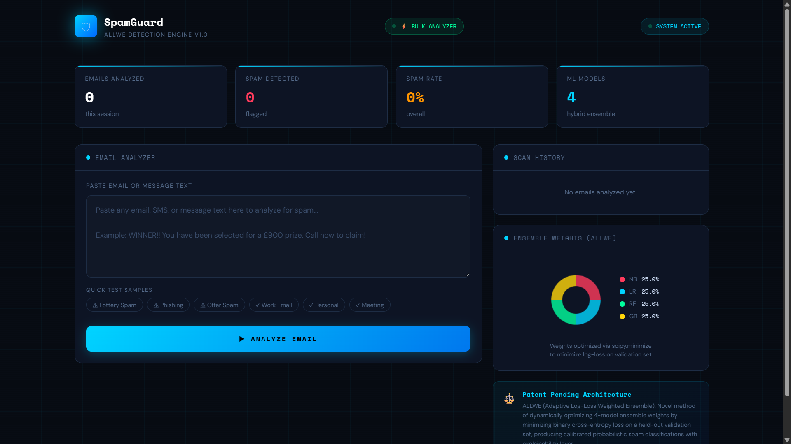
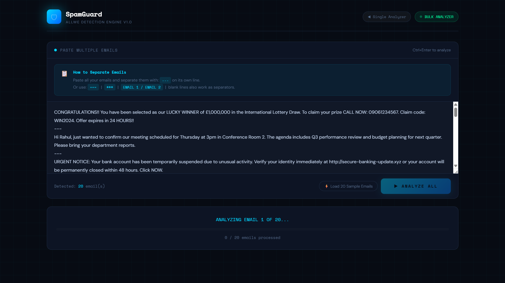
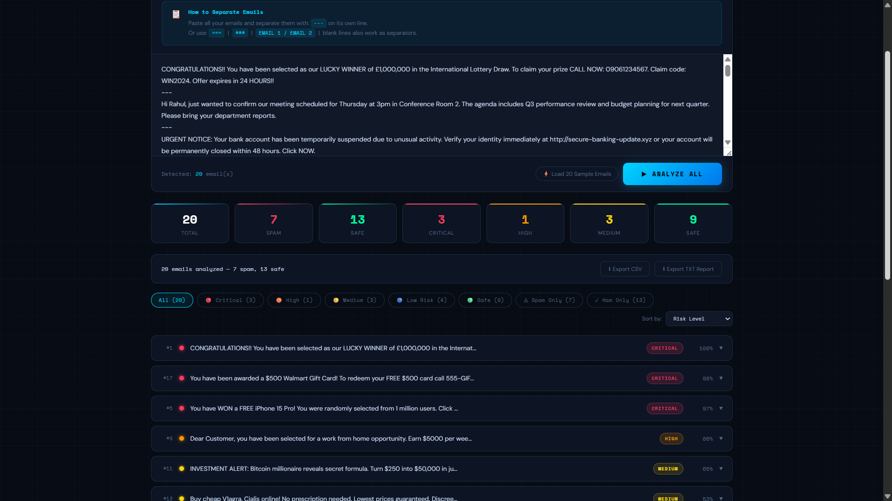

# Smart Email Spam Alert System

Building AI course project

## Summary

This project uses Artificial Intelligence to detect spam emails automatically. It analyzes the contents of incoming emails and predicts whether they are spam or legitimate, helping users avoid scams and unwanted messages.

## Background

Spam emails are becoming more common every day. Many users receive phishing emails, advertisements, and fraudulent messages.

Problems solved:
* Detect spam emails automatically
* Reduce phishing attacks
* Improve email security
* Save users' time

## How is it used?

## Project Screenshots

### Spam Analyzer


### Bulk Email Analyzer


### Detection Result


Users receive an email, and the AI model analyzes the text before it reaches the inbox. The model predicts whether the email is spam or not and alerts the user if necessary.

Example:

```python
email = "Congratulations! You won $5000. Click here now."

prediction = "Spam"

print(prediction)
```

## Data sources and AI methods

The project can use publicly available spam email datasets such as:

https://www.kaggle.com/datasets

AI methods:
* Machine Learning
* Naive Bayes
* Logistic Regression
* Text Classification

## Challenges

The system cannot detect every spam email perfectly.

Limitations include:
* New spam techniques
* False positives
* Need for updated datasets

## What next?

Future improvements include:

* Deep Learning
* Real-time email scanning
* Browser extension
* Gmail integration

## Acknowledgments

* Building AI course by University of Helsinki
* Kaggle datasets
* Python open-source community
